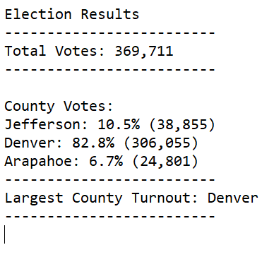

# Election_Analysis
Python
## Overview of Data
 The purpose of this election analysis was to track the winning candidate, vote count and percentage and track the largest county and county voter turnout to track. In the election results it shows that the largest county turnout was Denver with 306,055 votes with an overall of 83%. The winner candidate was Diane DeGette  with 272,892 winning votes with a 73.8%
### Election Audit Results

 
 
 
 
 
 #### Election Audit Summary
The script could be modified to give an idea on which county to enable us to assess the popularity of the individual benefit plans offered by them to help you decide the palette of benefits that will provide in the future. This also helped find the percentage of each county for each of the candidates.

   
   
  
